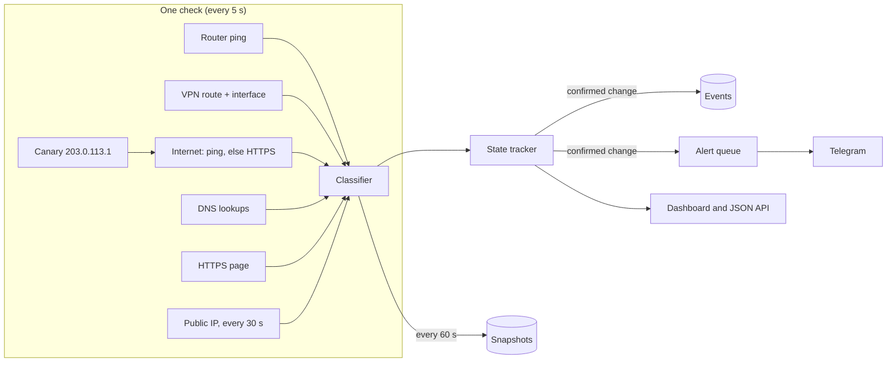

# How TashevNet works

TashevNet is one local process: a check loop, a small SQLite history, a web dashboard and
an optional Telegram bot. Nothing depends on a cloud service.

## A check

1. **Router and VPN.** The physical default gateway is read from the routing table (on
   macOS it is found even when a full-tunnel VPN owns the default route). The VPN is the
   interface that carries traffic to the first Internet host (`route get`, `ip route get`,
   `Find-NetRoute`); a VPN interface that is up but not routed counts as a split tunnel.
2. **Canary.** Once a minute, or whenever the VPN state changes, TashevNet pings and
   connects to `203.0.113.1`. Nothing on the Internet answers that documentation address,
   so an answer means a local proxy (a TUN-mode VPN client) is answering on the
   Internet's behalf.
3. **Internet.** Each Internet host is pinged. When ping fails or the canary showed that
   ping is answered locally, TashevNet sends an HTTPS `HEAD` to the same address over a
   kept-alive connection. Any HTTP answer proves the far end is reachable; a bare TCP
   connection proves nothing and is never counted.
4. **DNS and websites.** Names are resolved with the system resolver; the web check is a
   normal HTTPS request with certificate verification.
5. **Classification.** The first failing layer wins: router only when the Internet is also
   unreachable, then VPN, leak, DNS, web and finally latency. Reasons never contain
   numbers, so a steady problem keeps the same reason from check to check.

Latency is the median of the last five checks, taken from ICMP when it is trustworthy and
from reused HTTPS connections otherwise. A single slow packet does not make a slow line.

## From checks to incidents

`state.py` turns noisy checks into confirmed changes:

- a problem becomes an incident once it appears in `alert_after_checks` (2) of the last
  `recover_after_checks` (3) checks;
- the incident ends after `recover_after_checks` clean checks in a row, and the recovery
  records how long the incident lasted, measured from its first bad check;
- a healthy start is not an incident.

Only confirmed changes are written to the `events` table and sent to Telegram. The full
check is written to `snapshots` once a minute, and history older than `retention_days`
is deleted every hour.

## Staying alive

- Checks never wait for Telegram: alerts go to a queue and a separate loop delivers them
  when the network allows. Nothing a network outage does to Telegram can stop the checks.
- Every background loop runs under a supervisor that logs a crash and restarts it.
- The self-heal command runs in the background with a timeout; a hanging command is
  killed together with its children.
- `/healthz` returns `503` when no check has finished for six intervals (at least a
  minute), so launchd, systemd or Docker can see a stuck agent.

## Files

| Module | Job |
|---|---|
| `probes.py` | ping, DNS, HTTP and HTTPS probes, the canary, gateway discovery |
| `vpn.py` | routed interface, VPN detection, the self-heal runner |
| `classifier.py` | names the broken layer for one check |
| `state.py` | confirms incidents and recoveries |
| `monitor.py` | runs checks, keeps history, triggers alerts and self-heal |
| `telegram.py` | alert queue, message formatting, bot commands |
| `storage.py` | SQLite history |
| `app.py`, `static/index.html` | FastAPI app and the dashboard |
| `cli.py` | `run`, `once`, `doctor`, `telegram-id` |

## Future Cloud Watcher

A computer that lost the Internet cannot report it in time. An optional outside service
that receives heartbeats and alerts when they stop is planned; see [ROADMAP.md](ROADMAP.md).
