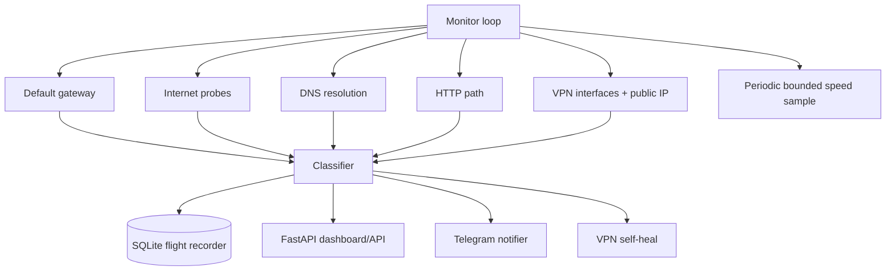

# Architecture

TashevNet is local-first. Monitoring continues without a cloud account.

## Design principles

1. **Correlate, do not trust one probe.** ICMP can be filtered while TCP still works.
2. **Local-first.** The agent is useful offline from any TashevNet cloud service.
3. **Low overhead.** Health probes are tiny; speed samples are rate-limited.
4. **Secrets stay out of Git.** Telegram credentials are environment variables.
5. **Self-healing is explicit.** TashevNet runs only a command configured by the operator.
6. **State changes are events.** The SQLite event log records meaningful transitions instead of flooding storage with alerts.

## Future Cloud Watcher

A separate optional service will accept agent heartbeats. This solves the fundamental notification gap: when the monitored machine loses all Internet access it cannot send Telegram itself, but the remote watcher can detect the missing heartbeat.
