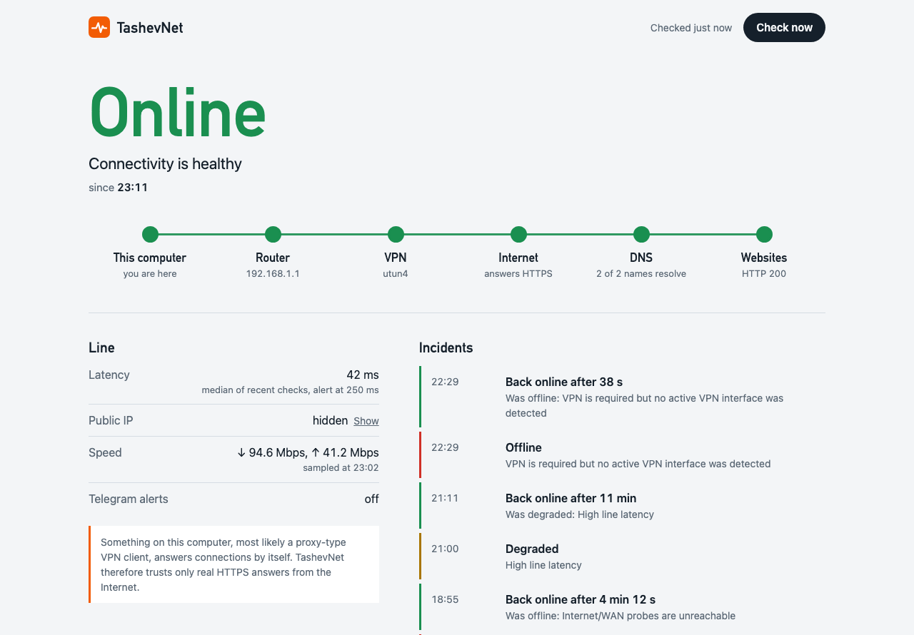
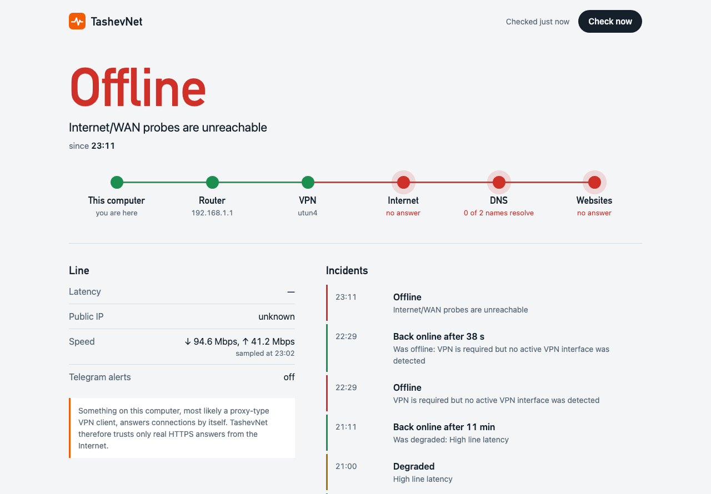

<p align="center">
  
</p>

<h1 align="center">TashevNet</h1>

<p align="center">
  <b>A flight recorder for your Internet connection.</b><br>
  It watches the whole path from your computer to the web, names the link that broke,<br>
  keeps a history of every outage and tells you about it in Telegram.
</p>

<p align="center">
  <a href="https://github.com/tashev11/tashevnet/releases/latest"></a>
  
  
  <a href="LICENSE"></a>
</p>

<p align="center">
  <a href="docs/README_RU.md">Русская версия</a> ·
  <a href="INSTALL.md">Install</a> ·
  <a href="docs/TELEGRAM.md">Telegram</a> ·
  <a href="ARCHITECTURE.md">How it works</a> ·
  <a href="CHANGELOG.md">Changelog</a>
</p>

<picture>
  <source media="(prefers-color-scheme: dark)" srcset="docs/assets/dashboard-dark.png">
  
</picture>

## Why

When the Internet stops working, the usual tools answer one question: is some host alive? TashevNet answers the questions you actually have:

- **What broke?** Wi-Fi and the router, the provider, DNS, the websites themselves, or the VPN?
- **When, and for how long?** Every outage is recorded with its start and its duration.
- **Did the VPN drop or leak?** It watches the VPN interface and, if you ask it to, your public IP.
- **Did the fix work?** It can run your VPN reconnect command and report the result.

It runs on your own computer, keeps its history in a local SQLite file and needs no account.

## Where it broke

TashevNet checks every link of the path on each run (every 5 seconds by default) and names the first link that fails.

<picture>
  <source media="(prefers-color-scheme: dark)" srcset="docs/assets/outage-dark.png">
  
</picture>

| Link | How it is checked | A failure means |
|---|---|---|
| Router | ping to the physical default gateway, found even behind a full-tunnel VPN | Wi-Fi or local network trouble. Counted only when the Internet is unreachable too: many routers simply ignore ping |
| VPN | the interface that really carries Internet traffic (a route lookup), plus the optional expected public IP | the VPN dropped, or traffic leaves outside the tunnel |
| Internet | ping to 1.1.1.1 and 8.8.8.8; when ping is blocked or faked, an HTTPS request that only the real server can answer | an outage at the provider or beyond |
| DNS | resolving a few well-known names | names stopped resolving while the Internet itself works |
| Websites | a normal HTTPS page request | the web path is broken although DNS works |
| Line quality | the median round trip of the last five checks | a slow line, above your threshold (250 ms by default) |

## Honest behind a proxy VPN

Many VPN apps in TUN mode (sing-box, Clash, Xray and their clients) accept every TCP connection on your own computer and some even answer ping for any address. A monitor that trusts those answers shows a green light while the tunnel is dead.

TashevNet first knocks on `203.0.113.1`, a documentation address that nothing on the Internet answers. If that knock "succeeds", the answers are coming from your own machine, so TashevNet ignores them and trusts only real HTTPS responses from the far end. The dashboard says so in plain words.

## Alerts worth reading

- One lost packet is not an outage: a problem becomes an incident once it shows up in 2 of the last 3 checks.
- A flapping line produces one incident, not a message every 5 seconds: recovery needs 3 clean checks in a row.
- Every recovery says how long the outage lasted: `🟢 back to UP after 4 min 12 s`.
- Alerts that could not be sent while you were offline wait in a queue and arrive, in order, as soon as the connection is back.

## Quick start

```bash
git clone https://github.com/tashev11/tashevnet.git
cd tashevnet
python3 -m venv .venv
source .venv/bin/activate
pip install -e .
cp config.example.yaml config.yaml
tashevnet doctor
tashevnet run
```

Open **http://127.0.0.1:8765**. Windows, Docker and start-at-login are covered in [INSTALL.md](INSTALL.md).

| Command | What it does |
|---|---|
| `tashevnet run` | monitoring, dashboard and the Telegram bot |
| `tashevnet once` | one check printed as JSON; exit code 2 when offline; writes nothing |
| `tashevnet doctor` | checks the config file, database folder, Telegram settings and local tools |
| `tashevnet telegram-id` | lists the chats that recently wrote to your bot |

### Telegram in a minute

1. Create a bot with **@BotFather** and send it any message.
2. Find your chat ID:
   ```bash
   export TASHEVNET_TELEGRAM_BOT_TOKEN="123456789:AA..."
   tashevnet telegram-id
   export TASHEVNET_TELEGRAM_CHAT_ID="123456789"
   ```
3. Set `telegram.enabled: true` in `config.yaml` and restart `tashevnet run`.

The bot answers `/status`, `/vpn`, `/events` and `/ping`, and only in your chat. Details: [docs/TELEGRAM.md](docs/TELEGRAM.md).

## Configuration

Every setting is optional; see [config.example.yaml](config.example.yaml) for the full list. A misspelled key is reported as an error, and a `--config` path that does not exist stops the start instead of silently falling back to defaults.

| Setting | Default | Meaning |
|---|---|---|
| `monitor.interval_seconds` | `5` | time between checks |
| `monitor.alert_after_checks` | `2` | bad checks, out of the last 3, that make an incident |
| `monitor.recover_after_checks` | `3` | clean checks in a row that end it |
| `monitor.degraded_latency_ms` | `250` | line latency that counts as degraded |
| `monitor.vpn_required` | `false` | treat a missing VPN as an outage |
| `monitor.vpn_expected_ip` | empty | your VPN exit address; any other public IP is a leak |
| `monitor.self_heal_vpn_command` | empty | command that reconnects the VPN, stopped after `self_heal_timeout_seconds` |
| `monitor.retention_days` | `30` | how long history is kept; pruned every hour |
| `speed.enabled` | `true` | a small hourly download and upload sample |
| `telegram.enabled` | `false` | alerts and bot commands |

Environment variables override the file: `TASHEVNET_CONFIG`, `TASHEVNET_TELEGRAM_BOT_TOKEN`, `TASHEVNET_TELEGRAM_CHAT_ID`, `TASHEVNET_HOST`, `TASHEVNET_PORT`, `TASHEVNET_DB_PATH`.

## API

| Endpoint | |
|---|---|
| `GET /api/status` | confirmed state, the latest check and the settings that shape it |
| `GET /api/events?limit=25` | recent state changes, newest first, with outage durations |
| `POST /api/check` | run a check now; requires the header `X-TashevNet: check` |
| `GET /healthz` | `200` while checks run, `503` when they have stopped |
| `GET /api/docs` | interactive OpenAPI reference |

## What it sends and where

- Ping to `1.1.1.1` and `8.8.8.8`, a few DNS lookups and one small HTTPS request to Cloudflare per check, over a kept-alive connection.
- Your public IP from `api.ipify.org` every 30 seconds and whenever the VPN state changes.
- The hourly speed sample moves about 2.5 MB, roughly 60 MB a day. Turn it off on metered connections.
- Telegram's API, only when you enable the bot. No telemetry, no accounts, no cloud.

## Status and limits

TashevNet is young. Version 0.1.1 was tested on macOS with Python 3.12 and 3.14, including live runs behind a proxy-type VPN, and has 84 automated tests.

- The Linux service file and the Docker image are included but have not been run on a real server for this release. Windows support is written but untested.
- VPN detection relies on interface names and routes; a split-tunnel VPN counts as connected.
- A computer without Internet cannot send an alert by itself. TashevNet delivers it after recovery; instant offline alerts need an outside watcher, which is on the [roadmap](ROADMAP.md).
- The dashboard has no login. Keep it on `127.0.0.1`.

## Contributing and security

Issues and pull requests are welcome: start with [CONTRIBUTING.md](CONTRIBUTING.md). Please report vulnerabilities as described in [SECURITY.md](SECURITY.md).

## License

[MIT](LICENSE) © Rinat Tashev
