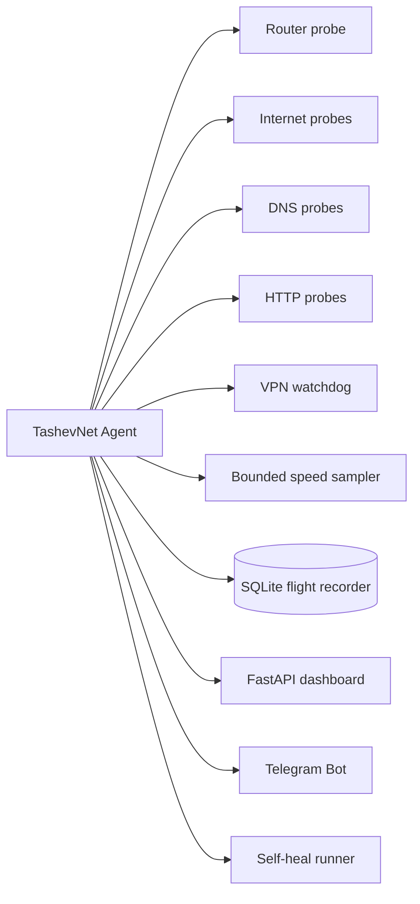

<p align="center">
  
</p>

<h1 align="center">TashevNet</h1>

<p align="center">
  <strong>Network flight recorder · VPN watchdog · self-healing connectivity monitor</strong>
</p>

<p align="center">
  
  
  
</p>

<p align="center">
  <a href="docs/README_RU.md">Русская документация</a> ·
  <a href="INSTALL.md">Install</a> ·
  <a href="docs/TELEGRAM.md">Telegram</a> ·
  <a href="ROADMAP.md">Roadmap</a>
</p>

TashevNet is a cross-platform local agent that continuously checks the whole connectivity chain — **device → router → ISP → DNS → Internet → VPN → target services** — records what happened, explains the likely cause and can try to recover automatically.

## Why

Most tools answer only one question: “is this host alive?” TashevNet correlates several signals and answers a more useful question:

> **What broke, when did it break, how long did it last, did VPN leak traffic, and did recovery work?**

## MVP features

- Internet health checks with multiple independent targets.
- Physical/default gateway detection, including macOS behind a full-tunnel VPN.
- DNS, TCP, HTTP and ICMP probes.
- WAN/gateway latency degradation detection without confusing slow HTTP with line latency.
- VPN route/interface watchdog.
- Optional expected VPN public-IP check and VPN leak detection.
- Configurable VPN self-heal command with cooldown.
- Bounded periodic speed sampling that runs independently from health probes.
- SQLite network flight recorder with snapshot throttling and retention.
- Responsive local FastAPI dashboard and JSON API.
- Telegram notifications.
- Telegram commands: `/status`, `/vpn`, `/events`, `/ping`.
- Helper command to discover a Telegram `chat_id`.
- Docker / Compose examples.
- macOS / Windows / Linux architecture and auto-start examples.
- Ruff + pytest workflow and local `make check`.

## Quick start

```bash
git clone https://github.com/tashev11/tashevnet.git
cd tashevnet
python3 -m venv .venv
source .venv/bin/activate
pip install -e ".[dev]"
cp config.example.yaml config.yaml
tashevnet doctor
tashevnet run
```

Open **http://127.0.0.1:8765**. If that port is already occupied, change `app.port` in `config.yaml`.

### Telegram in 60 seconds

1. Create a bot with **@BotFather**.
2. Send any message to your new bot.
3. Set the token and discover the chat ID:

```bash
export TASHEVNET_TELEGRAM_BOT_TOKEN="123456:ABC..."
tashevnet telegram-id
export TASHEVNET_TELEGRAM_CHAT_ID="123456789"
```

4. In `config.yaml` set `telegram.enabled: true`.
5. Run `tashevnet doctor`, restart TashevNet and send `/status` to the bot.

Full guide: [docs/TELEGRAM.md](docs/TELEGRAM.md).

## What TashevNet can diagnose

| Situation | Interpretation |
|---|---|
| Physical gateway unavailable | local network / router issue |
| Gateway OK, Internet probes fail | ISP / WAN outage |
| IP connectivity OK, DNS fails | DNS incident |
| DNS OK, HTTP fails | HTTP / service path problem |
| Internet OK, VPN route/interface missing | VPN disconnected |
| VPN active, public IP unexpected | possible VPN leak |
| WAN/gateway latency exceeds threshold | degraded line |
| State returns to normal | recovery event |

## Architecture



The local agent is intentionally useful without a cloud account. A future optional **Cloud Watcher** will receive heartbeats so a remote service can detect a machine that lost Internet and therefore cannot notify Telegram itself.

## Configuration

Copy `config.example.yaml` to `config.yaml`. Secrets should be supplied via environment variables, never committed.

Important settings:

- `monitor.interval_seconds`
- `monitor.snapshot_interval_seconds`
- `monitor.retention_days`
- `monitor.degraded_latency_ms`
- `monitor.vpn_required`
- `monitor.vpn_expected_ip`
- `monitor.self_heal_vpn_command`
- `speed.interval_minutes`
- `telegram.enabled`

## Verification

The v0.1 MVP has been linted and tested locally on macOS, including a live diagnostic cycle and live FastAPI/dashboard checks. The GitHub Actions workflow is included and ready; repository runner execution currently depends on the account's GitHub Actions availability.

## Roadmap

See [ROADMAP.md](ROADMAP.md). Open roadmap work is also tracked in GitHub Issues.

## Security

TashevNet does not need root privileges for normal monitoring. A self-heal command runs with the permissions of the TashevNet process, so treat it as trusted configuration. See [SECURITY.md](SECURITY.md).

## Contributing

Issues and pull requests are welcome. Start with [CONTRIBUTING.md](CONTRIBUTING.md).

## License

MIT © Rinat Tashev
